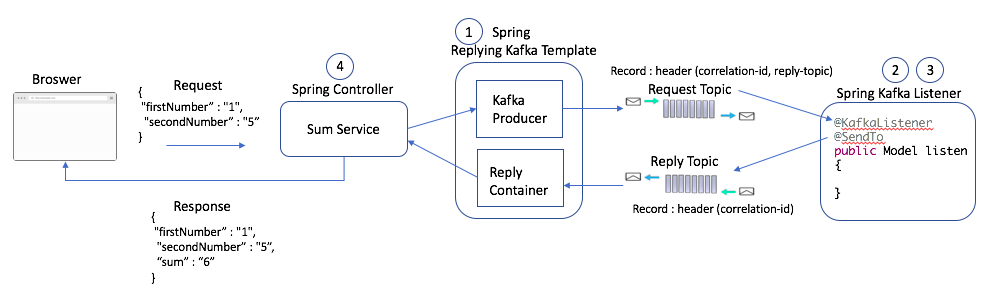

# Kafka replying example

## Kafka Replying: Understanding the Concept

Kafka Replying refers to the mechanism of sending a message to a Kafka topic and expecting a response or reply message back on a different topic. This pattern is commonly used for asynchronous request-response interactions within distributed systems.

## Key Components:
- Request Topic: The topic where the original message (request) is sent.
- Reply Topic: The topic where the response is expected to be published.
- Correlation ID: A unique identifier associated with the request, used to match the response to the correct request.

## Spring ReplyingKafkaTemplate - https://dzone.com/articles/synchronous-kafka-using-spring-request-reply-1

Request-reply semantics are not natural to Kafka. In order to achieve the request-reply pattern, the developer has to build a system of correlation IDs in the producer records and match that in the consumer records.
With the latest release of Spring-Kafka, these request-reply semantics are now available off-the-shelf. This example demonstrates the simplicity of the Spring-Kafka implementation.

The below picture is a simple demonstrative service to calculate the sum of two numbers that requires synchronous behavior to return the result.



### Set Up Spring ReplyingKafkaTemplate
This class extends the behavior of `KafkaTemplate` to provide request-reply behavior. To set this up, you need a producer (see `ProducerFactory`) and `KafkaMessageListenerContainer`. This is an intuitive setup since both producer and consumer behavior is needed for request-reply.

### Set Up Spring-Kafka Listener
This is the standard setup of the Kafka Listener. The only additional change is to set the `ReplyTemplate` in the factory. This is needed since the consumer will now also need to post the result on the reply-topic of the record.

### Sum Service
Now, let's bring all of this together. Spring automatically sets a correlation ID in the producer record. This correlation ID is returned as-is by the `@SendTo` annotation at the consumer end.

### Kafka Consumer
This is the same consumer that you have created in the past. The only change is the additional `@SendTo` annotation. This annotation returns a result on the reply topic.

## Start dependencies

Start the Kafka cluster locally with docker-compose:
```shell
docker-compose up
```

## Usage

### Pact tests - https://github.com/pactflow/example-consumer-java-kafka/blob/master/README.md

- Producing test events into the product topic: make test-events
- Retrieve latest products: curl localhost:8080/products
- Retrieve latest products: http://localhost:8080/products
- Retrieve specific product: http://localhost:8080/product/{id}

### Spring ReplyingKafkaTemplate

- Start the application with gradle 
```shell
./gradlew bootRun
```
- Post the numbers using CURL
```shell
curl -H 'Content-Type: application/json' -s -XPOST http://localhost:8080/sum -d '{"firstNumber":"1", "secondNumber":"5"}'
```
